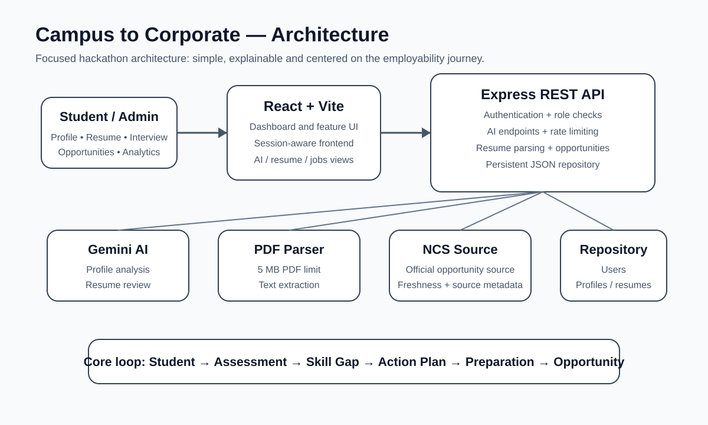

# 🎓 Campus to Corporate

### AI-powered employability platform that turns a student's current skills into a personalized path to employment.

**Campus to Corporate (C2C)** helps students answer:

> **Where am I today? → What am I missing? → What should I do next?**

It connects profile assessment, skill-gap discovery, resume improvement, interview preparation and verified career opportunities in one workflow.

## The problem

Students often have scattered information about their skills, resumes, courses and job opportunities. Individual tools may solve one part of the problem, but the student still has to decide what to do next.

C2C is designed around the complete employability journey:

**Student profile → AI assessment → skill gaps → action plan → resume → interview → opportunity**

## What the product does

| Area | What C2C provides |
|---|---|
| Profile & assessment | Understands a student's goals, skills and experience |
| Skill gaps | Identifies areas that need improvement |
| Action planning | Turns gaps into practical next steps |
| Resume | Parses PDF resumes and provides AI-assisted review |
| Interview | Provides interview practice and feedback |
| Opportunities | Displays opportunities with source/freshness metadata |
| Admin view | Demonstrates learner, placement and skill-trend analytics |

## Why this is more than a chatbot

The AI is embedded inside a workflow rather than presented as a standalone chat screen.

**Profile + resume → AI analysis → skill gaps → actions → preparation → opportunities**

See AI_USAGE.md for exactly where AI is used and how fallback behavior works.

## 3-minute demo

The recommended judge flow is documented in docs/demo/demo-script.md:

1. Open a student profile.
2. Run AI profile analysis.
3. Show skill gaps and recommended actions.
4. Upload a resume PDF and review the extracted text.
5. Run resume feedback.
6. Practice an interview question.
7. Show feedback.
8. Open opportunities and point out source/freshness metadata.
9. Close with the end-to-end employability loop.

## Architecture

    Student / Admin
           |
           v
    React + Vite
           |
           v
    Express REST API
      |     |      |       |
      v     v      v       v
     Auth  Store  Gemini  PDF Parser
                    |
                    v
              AI responses

    Express API ---> National Career Service
    Express API ---> React UI

\n\nDetailed diagrams and security boundaries are in docs/architecture.md.

## AI and security

- Google Gemini is called from the backend.
- The Gemini API key is never sent to the browser.
- Authentication uses JWT with an HttpOnly session cookie.
- Bearer authentication remains available for API clients.
- JWT issuer and audience are verified.
- Authentication and AI endpoints are rate-limited.
- Admin-only routes use role middleware.
- Resume upload is restricted to PDF and 5 MB.
- Runtime database files are ignored by Git.
- Deterministic AI fallbacks are clearly documented.

See AI_USAGE.md and LIMITATIONS.md.

## Verified opportunities

The integrated verified source is the **National Career Service (NCS)** latest-updates page.

C2C exposes source/freshness information and returns an empty result with source-error metadata if the external source cannot be fetched. It does not invent live job listings.

## Tech stack

- **Frontend:** React 19, Vite, Tailwind CSS, Recharts, Lucide React
- **Backend:** Node.js, Express, JWT, CORS, dotenv
- **AI:** Google Gemini via @google/genai
- **Resume processing:** pdf-parse
- **Persistence:** JSON-backed repository for the hackathon prototype
- **Quality:** GitHub Actions, Oxlint

## Illustrative student journey

**Example only — not a measured result.**

A final-year student targeting backend software roles could provide Java, C++, SQL, DSA and REST API experience. C2C can use that context to surface missing areas, turn them into an action plan, improve the resume, generate interview practice and then connect the student with available opportunities.

The important product idea is the **closed loop**: recommendations are connected to preparation and opportunities rather than ending at a single AI answer.

## Technology decisions

| Decision | Why it fits this prototype |
|---|---|
| React + Vite | Fast, component-based UI development and simple local setup |
| Express | Small, understandable REST API boundary |
| JSON repository | Persistent single-instance demo data without unnecessary infrastructure |
| Gemini | Natural-language analysis and personalized employability feedback |
| PDF parser | Turns a real resume upload into structured text for review |
| NCS source | Gives opportunity data a traceable official source |
| GitHub Actions | Automates lint, build and backend syntax validation |

## Impact measurement plan

No impact numbers are invented in this repository. For a future pilot, measure:

- time from first login to a completed action plan;
- percentage of students completing resume review;
- percentage completing at least one interview practice session;
- number of skill-gap actions completed;
- opportunity click-through rate;
- student-reported usefulness of recommendations.

## Project structure

    .
    ├── frontend/
    │   ├── src/
    │   │   ├── components/
    │   │   ├── data/
    │   │   ├── services/
    │   │   ├── App.jsx
    │   │   └── main.jsx
    │   └── package.json
    ├── backend/
    │   ├── database/
    │   ├── middleware/
    │   ├── routes/
    │   ├── services/
    │   ├── server.js
    │   └── package.json
    ├── docs/
    │   ├── architecture.md
    │   ├── demo/
    │   └── screenshots/
    ├── .github/
    │   └── workflows/ci.yml
    ├── AI_USAGE.md
    ├── LIMITATIONS.md
    └── README.md

## Local setup

### 1. Install dependencies

    cd frontend
    npm install

In another terminal:

    cd backend
    npm install

The repository currently uses npm install in CI because the backend lockfile must be regenerated after the current dependency set is finalized. See HACKATHON_READINESS.md.

### 2. Configure the backend

Copy backend/.env.example to backend/.env.

At minimum, configure a strong local JWT_SECRET. Add GEMINI_API_KEY when you want Gemini-backed responses.

### 3. Start the backend

    cd backend
    npm start

### 4. Start the frontend

    cd frontend
    npm run dev

## Demo personas

The application includes student/admin demo flows for local development. Demo credentials are intended only for local development and should never be reused in production.

## API

| Method | Endpoint | Purpose |
|---|---|---|
| GET | /api/health | Health check |
| GET | /api/auth/personas | Demo personas |
| POST | /api/auth/register | Register user |
| POST | /api/auth/login | Authenticate user |
| POST | /api/auth/logout | End session |
| GET | /api/auth/verify | Verify session |
| PATCH | /api/auth/profile | Update authenticated profile |
| POST | /api/ai/analyze-profile | AI profile analysis |
| POST | /api/ai/review-resume | AI resume review |
| POST | /api/ai/parse-resume | Parse uploaded resume PDF |
| GET | /api/jobs | Verified-source job opportunities |
| GET | /api/govt-schemes | Government opportunity data |
| GET | /api/sources | Opportunity source metadata |

## CI pipeline

    Push / Pull Request
           |
           +----> Frontend install -> lint -> build
           |
           +----> Backend install -> Node syntax checks
           |
           v
        CI result

GitHub Actions is configured for main and develop pushes and pull requests.

## Git workflow

    main
      |
    develop
      |
    feature/* or bugfix/*
      |
    Pull Request
      |
    CI
      |
    develop
      |
    main

## Hackathon readiness

The repository now includes a tracked implementation plan in HACKATHON_READINESS.md.

### P0 — submission blockers

- Real screenshots of the working product
- 2–3 minute demo recording
- Green CI
- No committed secrets
- Clear README and demo path
- Honest AI and limitation documentation

### P1 — high impact

- Current frontend and backend lockfiles
- GitHub repository description/topics
- Stable public deployment, if available
- End-to-end smoke tests
- Final architecture visual

### P2 — polish

- Demo GIF/video link
- Measured impact metrics
- Additional architecture visual
- Security/dependency scanning

### P3 — avoid unnecessary complexity

Do not add Kafka, Redis, Kubernetes, blockchain, microservices or extra AI providers unless a real product requirement appears. The product story is stronger when the architecture stays focused.

## Screenshots

See docs/screenshots/README.md for the exact P0/P1 screenshot checklist.

## Limitations

This is a hackathon-ready prototype. Important limitations include JSON-backed persistence, one verified opportunity source, AI variability, text-oriented PDF parsing and prototype-scale rate limiting.

Full details are in LIMITATIONS.md.

## Contributing

See CONTRIBUTING.md for branch, commit, issue and pull-request conventions.

## License

See LICENSE.