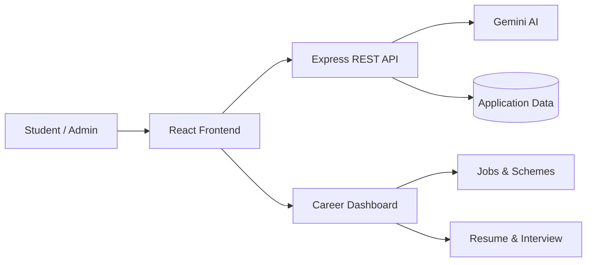
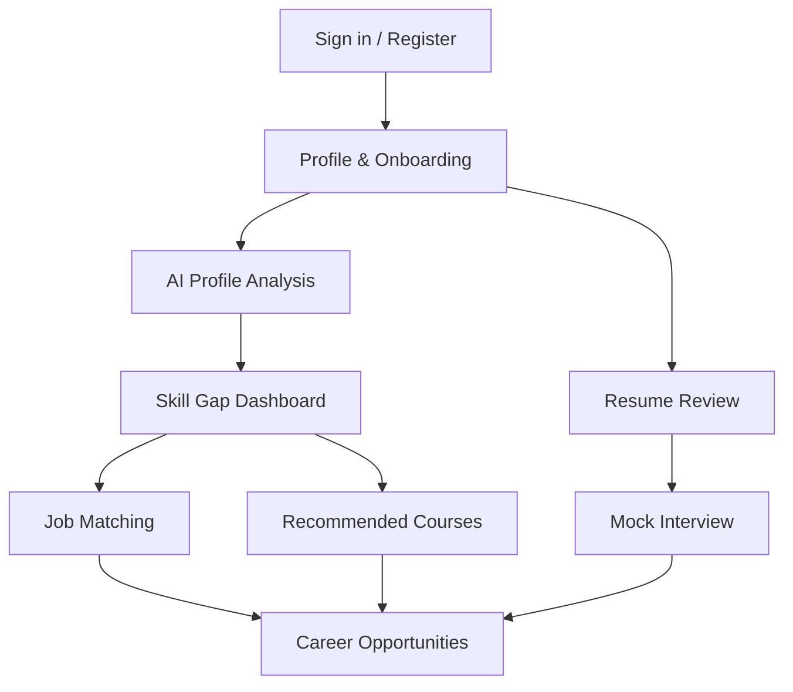
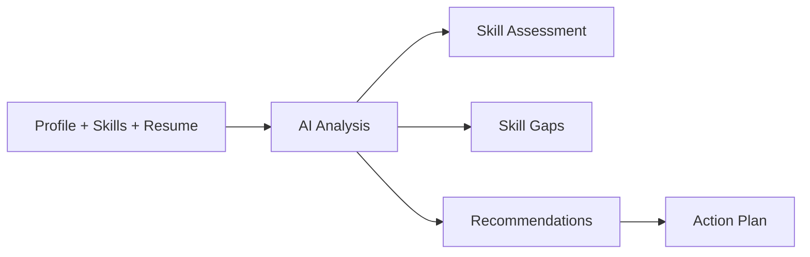
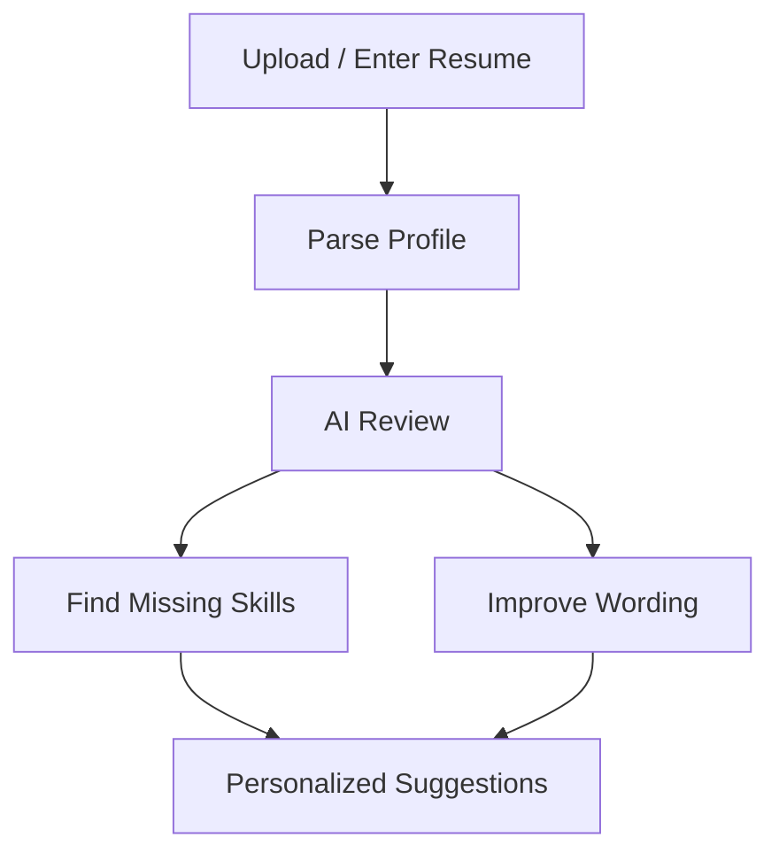
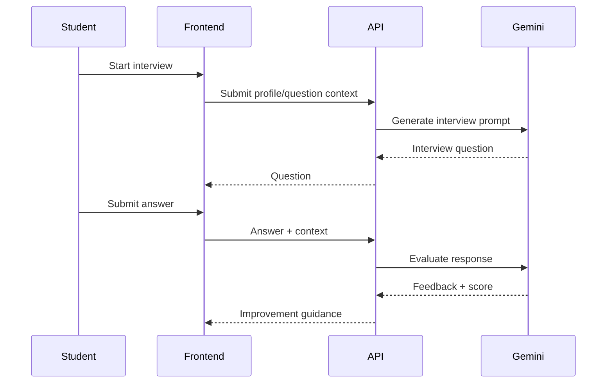
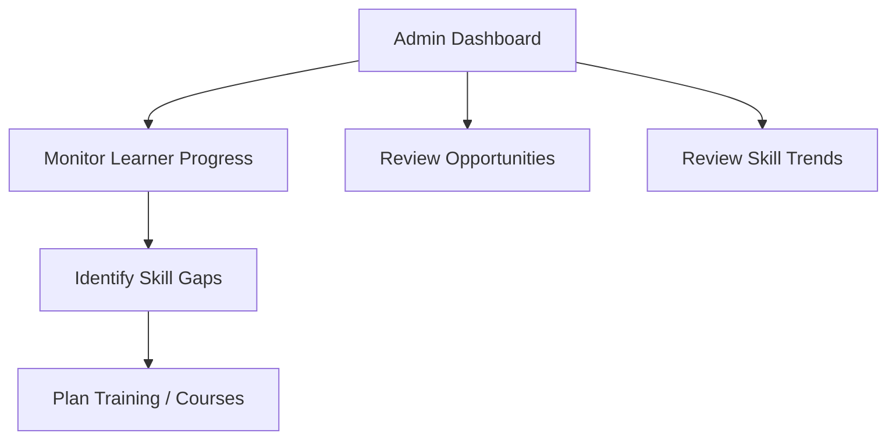
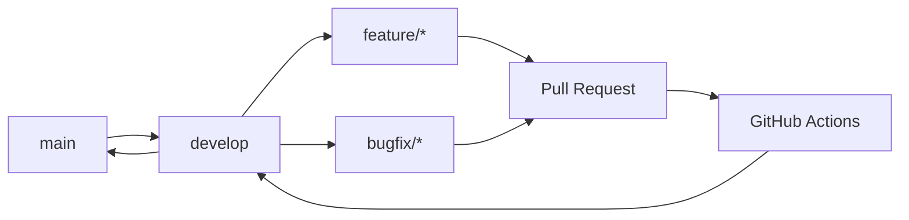
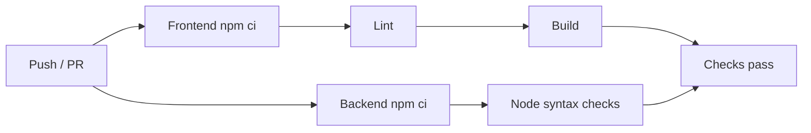

# MPOnline Project

AI-powered career readiness and employability platform for students.

## Overview

MPOnline Project helps students assess skills, improve resumes, practice interviews, discover jobs and government opportunities, and receive AI-assisted career guidance.

## Architecture



## Student Journey



## AI Employability Flow



## Resume Optimization



## Mock Interview



## Admin / Placement Analytics



## Tech Stack

- Frontend: React, Vite, Tailwind CSS, Recharts, Lucide React
- Backend: Node.js, Express, JWT, CORS, dotenv
- AI: Google Gemini via `@google/genai`
- Quality: GitHub Actions, Oxlint

## Project Structure

```text
.
├── frontend/
│   ├── src/
│   │   ├── components/
│   │   ├── data/
│   │   ├── services/
│   │   ├── App.jsx
│   │   └── main.jsx
│   └── package.json
├── backend/
│   ├── middleware/
│   ├── routes/
│   ├── server.js
│   └── package.json
├── .github/
│   ├── ISSUE_TEMPLATE/
│   ├── pull_request_template.md
│   └── workflows/ci.yml
├── package.json
└── README.md
```

## Local Setup

```bash
# install frontend dependencies
cd frontend
npm ci

# in another terminal, install backend dependencies
cd backend
npm ci

# start backend
npm start

# start frontend
cd ../frontend
npm run dev
```

Copy `backend/.env.example` to `backend/.env` and configure the required environment variables before using external AI services.

## Demo Personas

The application includes student/admin demo flows for local development. Do not use demo credentials in production.

## API

| Method | Endpoint | Purpose |
|---|---|---|
| GET | `/api/health` | Health check |
| GET | `/api/auth/personas` | Demo personas |
| POST | `/api/auth/register` | Register user |
| POST | `/api/auth/login` | Authenticate user |
| GET | `/api/auth/verify` | Verify JWT |
| POST | `/api/ai/analyze-profile` | AI profile analysis |
| POST | `/api/ai/review-resume` | AI resume review |
| GET | `/api/jobs` | Job opportunities |
| GET | `/api/govt-schemes` | Government schemes |

## Git Workflow



## CI Pipeline



## Security Notes

The current application is a hackathon/demo baseline. Before production deployment, move users and opportunity data to persistent storage, rotate secrets, remove demo credentials, validate inputs, add rate limiting, and harden authentication and authorization.

## Roadmap

- Persistent database and migrations
- Production authentication and RBAC
- Verified live opportunity integrations
- Resume PDF parsing
- Advanced employability analytics
- Notifications and application tracking
- Deployment infrastructure and observability

## Contributing

See `CONTRIBUTING.md` for branch, commit, issue, and pull-request conventions.

## License

See `LICENSE`.
